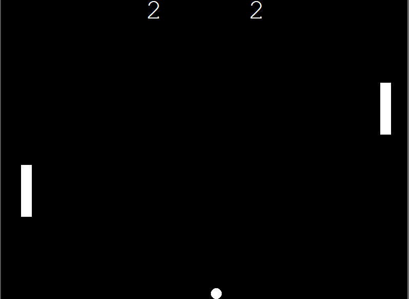

# Ping Pong Game 🏓


A simple Ping Pong game built using Python Turtle graphics.

## Features
- Two-player control (W/S and Arrow keys)
- Ball physics and collision detection
- Score tracking system
- Increasing difficulty over time

## Controls
- Right Paddle: Up / Down arrows
- Left Paddle: W / S keys

## Tech Stack
- Python
- Turtle Graphics

## How to Run
```bash
python main.py
